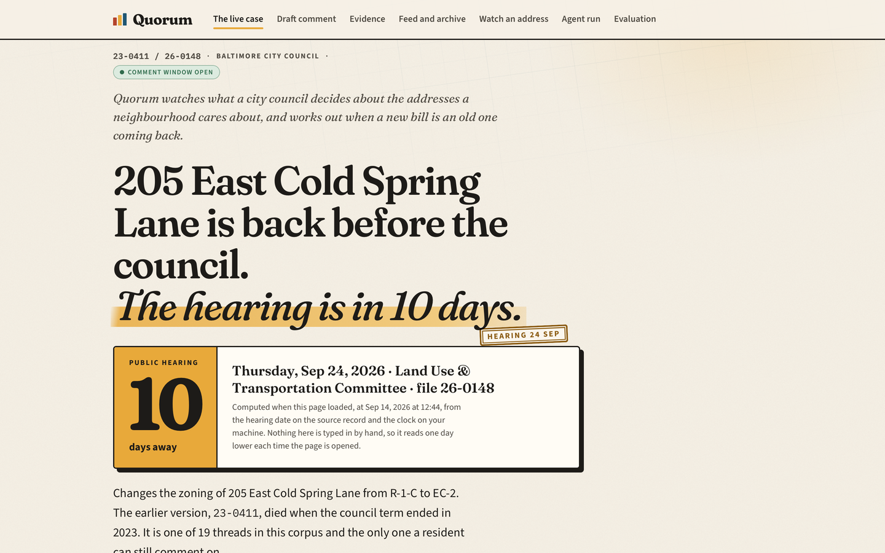
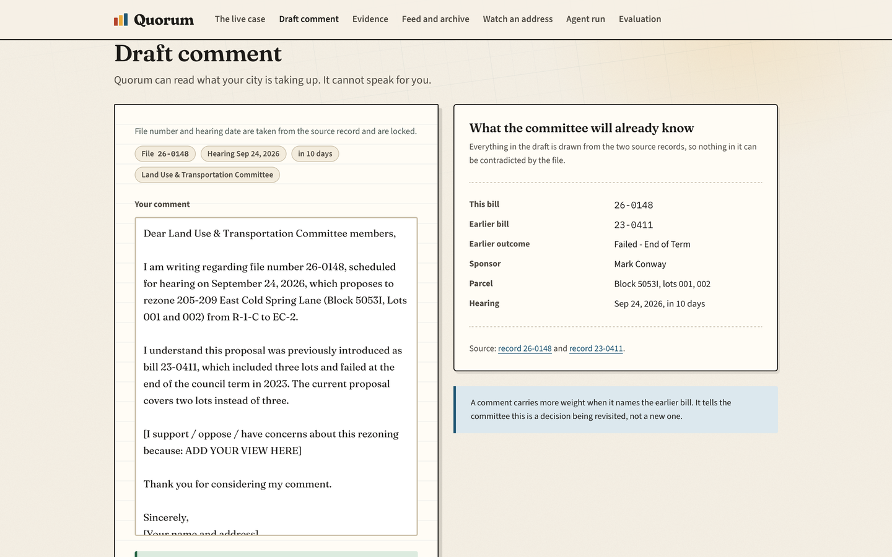
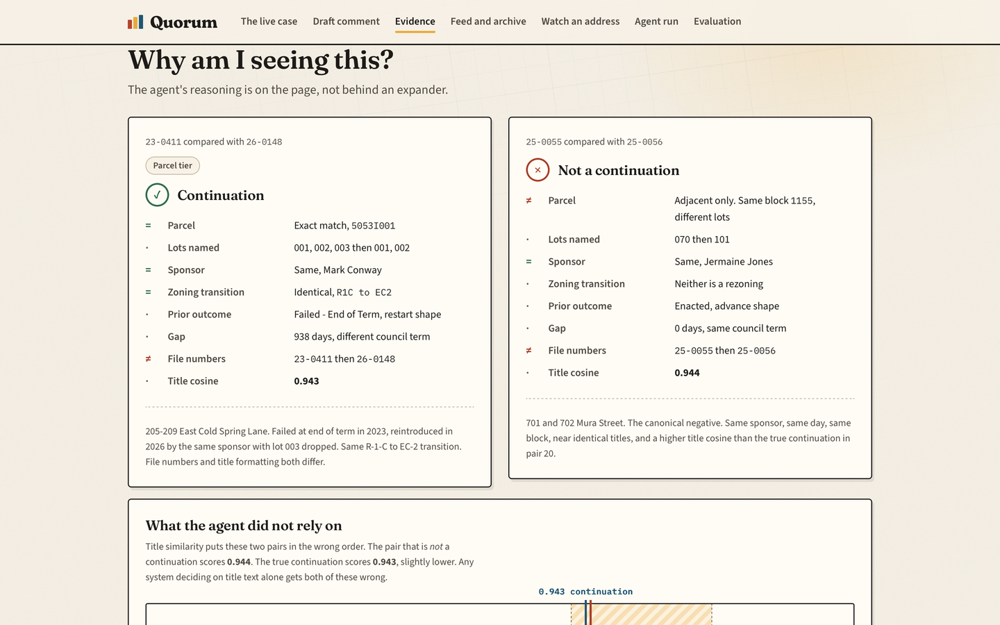
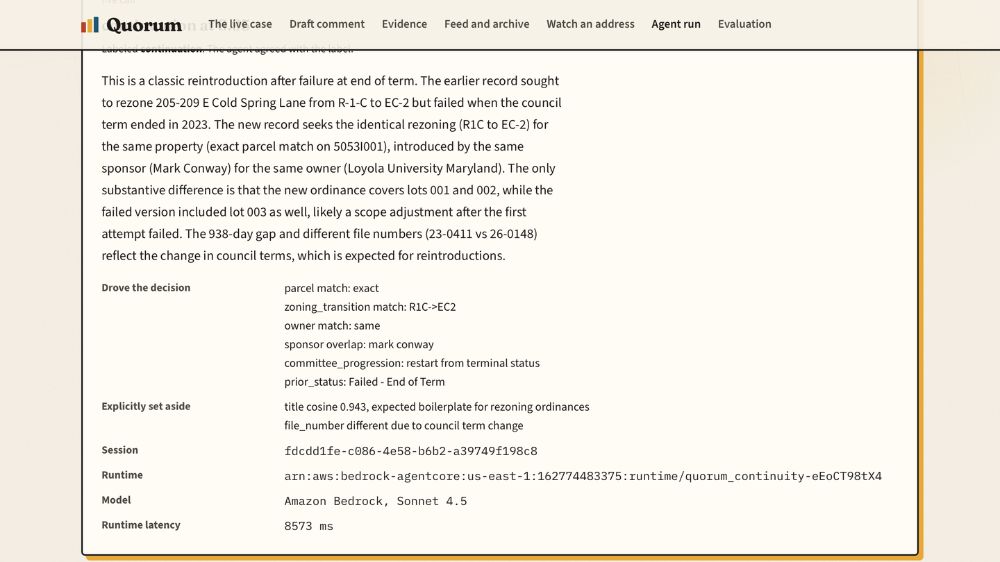
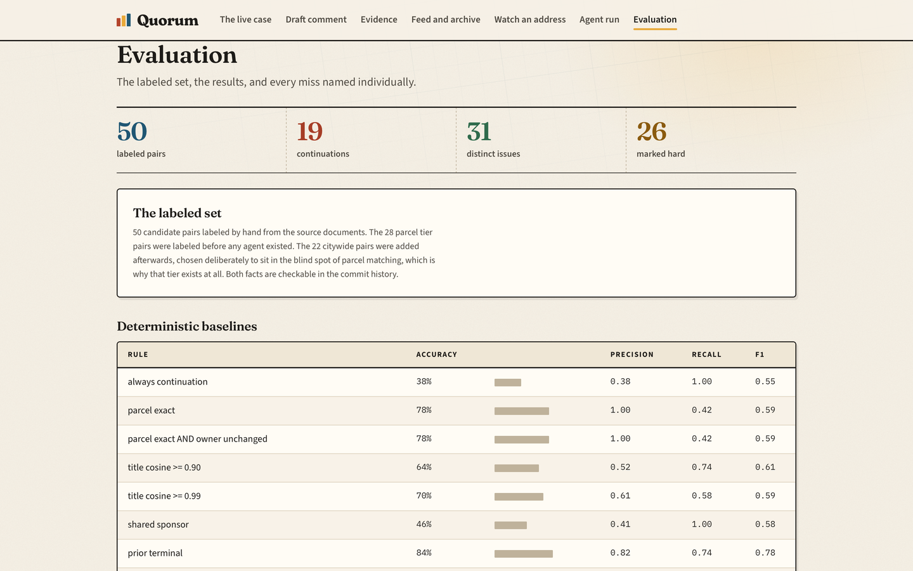
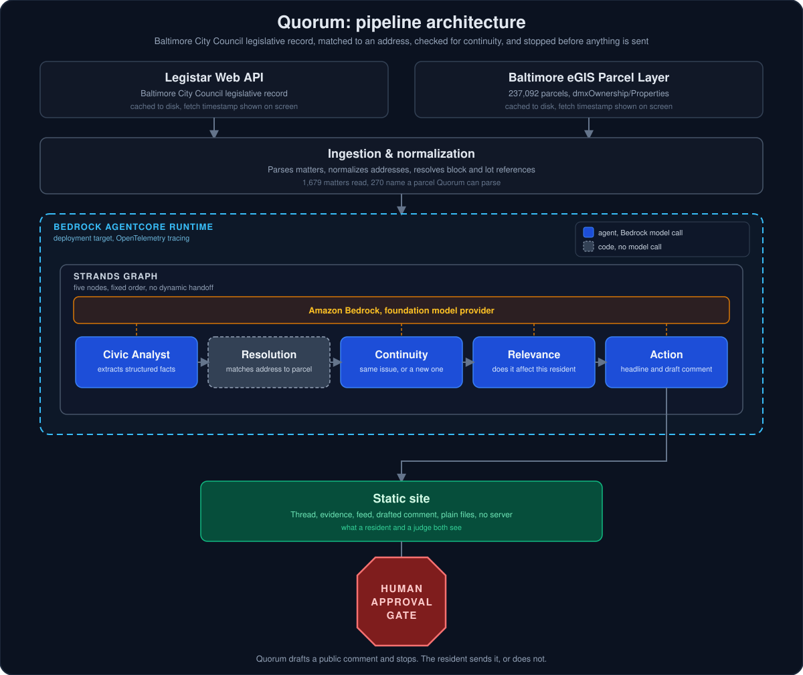

# Quorum

**Cities decide slowly, across many meetings, under changing labels. Residents lose because nobody can hold the thread. Quorum holds the thread.**

Quorum maintains a persistent model of the civic issues that touch a specific address. It ingests Baltimore City Council's published legislative record, resolves each item to a parcel, decides whether the item is a *continuation of an issue it has already seen*, explains what changed since the last appearance, and drafts a public comment carrying the correct file number and hearing date, only when a comment window is actually open on that item.

If the underlying record is already decided, enacted, withdrawn or failed, Quorum does not draft a comment at all. It shows the status, the date, the sponsors, the committee and the source records instead, and says plainly why there is nothing left to send. Of the 19 continuation threads published on the site today, only 1 has an open comment window.

It never submits anything on a person's behalf.

Built for the **Agents for Humans Hackathon**, Good Neighbor track, with the [Strands Agents SDK](https://strandsagents.com), on Amazon Bedrock.

**Live demo: https://quorum-peach.vercel.app**

**Demo video: https://youtu.be/Lj1kMZdy7xk**

[](https://quorum-peach.vercel.app)

| | |
|---|---|
|  |  |
| **Draft comment.** File number and hearing date come from the record. Quorum never sends it. | **Evidence.** What drove the decision, and what the agent explicitly set aside. |
|  |  |
| **Run it yourself.** A real call to the AgentCore runtime, with a new session id every time. | **Evaluation.** 50 hand labeled pairs, the baselines that tie the agent, and where they break. |

**Run the agent yourself:** the agent run screen has a button that invokes the deployed
AgentCore runtime against Amazon Bedrock on any of the 50 labeled pairs, and returns the
runtime identifier, the AgentCore session id, the model id and the measured latency. The
session id is different on every call, which is how you can tell it is not a replay. The
endpoint is `https://1gpbm1pph4.execute-api.us-east-1.amazonaws.com`. (mirrored at https://rickygole.github.io/Quorum/)

The published site runs entirely on a cached, timestamped corpus. No demo fetches civic
data at runtime, and the fetch timestamp is shown on screen. The page itself loads a web
font and three.js from public CDNs, and it calls Quorum's own endpoint when you press Run on
the agent screen. It never calls Legistar or the city's GIS at page load.

The Continuity Agent is also deployed to **Bedrock AgentCore Runtime** and verified live by
direct invocation, with OpenTelemetry tracing enabled. See
[ARCHITECTURE.md](ARCHITECTURE.md) and [deploy/README.md](deploy/README.md) for what is
deployed, what it returns on a real call, and the three bugs that only showed up once it
left a laptop.



---

## The three gates

The build spec required three questions answered with real data before any agent code was written. Here are the answers, with the numbers.

### Gate A: does one source carry every item type?

**Yes.** Baltimore runs Legistar, and its Web API is live, public and unauthenticated at
`https://webapi.legistar.com/v1/baltimore`. It carries matters, action histories, sponsors,
attachments and event agendas.

Quorum's scope is deliberately drawn around what this **one** source holds: City Council
ordinances and resolutions. Zoning appeals (BMZA), liquor licenses (BLLC) and tax sale
(Bureau of Revenue Collections) are three other agencies with three other publishing habits,
and Quorum does not claim them. One source, one city, deep.

### Gate B: does the hero example exist?

**Yes, and it is live right now.** Found by hand in the corpus before the Continuity Agent
was written. The commit history shows the 28 parcel tier labels landing before `agents/continuity.py`
existed, and the 22 citywide labels landing after it, because that tier was built on purpose to
cover what parcel matching cannot see.

**205-209 East Cold Spring Lane, Kernewood**, owned by Loyola University Maryland.

| | File | Introduced | Sponsor | Scope | Outcome |
|---|---|---|---|---|---|
| 1 | `23-0411` | 2023-07-17 | Mark Conway | Block 5053I, Lots 001, **002, 003** | **Failed, End of Term** |
| 2 | `26-0148` | 2026-02-09 | Mark Conway | Block 5053I, Lots 001, **002** | **In Committee** |

Both bills rezone the same land from `R-1-C` to `EC-2`. The first died quietly when the
council term ended. Two and a half years later the same sponsor reintroduced it under an
unrelated file number, one lot smaller, and a **public hearing is scheduled for 2026-09-24**.

This case is the product thesis in one row, and it is hard on purpose:

- The file numbers share nothing (`23-0411` vs `26-0148`).
- The titles differ in formatting (`East Cold Spring Lane` vs `E Cold Spring Lane`,
  `R-1-C` vs `R 1 C`), so naive string matching fails.
- What carries the match is the **parcel** (block 5053I), the **sponsor**, and the
  **zoning transition**, not title similarity. That is exactly the drivers and non-drivers
  distinction the Continuity Agent is built to make explicit.

Independent corroboration from the city's own parcel table: block 5053I holds exactly two
lots today (the 2023 bill named three), and its zoning is still `R-1-C`, so the 2023
rezoning demonstrably never happened.

A second verified case, **4911-4925 West Forest Park Avenue**: `22-0295` (Withdrawn) then
`23-0417` (Failed, End of Term), identical titles, two sponsors narrowing to one.

### Gate C: what does the corpus actually support?

Counted, not estimated. Every figure below comes from the same cached corpus and the
same parcel parser, so they can be added up against each other.

| | |
|---|---|
| Matters in the corpus, introduced 2021-01-11 to 2026-07-13 | **1,679** |
| Fetched at | `2026-09-10T02:14:14Z` |
| Matters that name a parcel Quorum can parse | **266** |
| Of those, resolving to a parcel in the city gazetteer | **252** |
| Parcels appearing under two or more file numbers | **9** |
| Matters introduced 2025-01-01 onward | **505** |
| Of those, naming a parcel | **59** |
| Parcels in the gazetteer | **237,092** |

**How the evaluation set relates to those numbers.** The labeled set is **50 pairs**, not 50
records, and it is built in two tiers:

| Tier | How pairs were generated | Pairs | Continuations | Distinct issues | Hard |
|---|---|---|---|---|---|
| Parcel | Both records touch the same parcel or the same block | 28 | 8 | 20 | 14 |
| Citywide | No shared parcel; shared sponsor and title cosine at or above 0.97 | 22 | 11 | 11 | 12 |
| **Total** | | **50** | **19** | **31** | **26** |

The second tier exists because the first one is not enough on its own. Probing what parcel
matching misses turned up a whole class of true continuation it cannot see: citywide bills
that die at end of term and return under a new file number with no parcel anywhere in them.
Sitting immediately beside them are recurring annual bills with identical titles that are
**not** continuations. See [eval/RESULTS.md](eval/RESULTS.md).

**What the split shows.** On the parcel tier, matching on the parcel alone finds all 8 true
continuations, because a parcel match is deterministic code doing exactly the job it was
built for. On the citywide tier, the same parcel lookup finds **0 of the 11** true
continuations, because those records name no property Quorum can resolve: a charter
amendment, a tipped wage bill, a conservation district. **11 of the 19 true continuations
in this set, 58%, carry no parcel at all.** That is the majority of the problem a parcel
lookup is structurally blind to, and it is where the Continuity Agent, reasoning over the
full feature table rather than a single field, earns its place.

**What the domain guidance is worth.** The Continuity Agent's prompt tells the model, in
prose, which features matter and why. With every domain hint stripped out and only the
task, the schema, and an instruction not to invent facts left in place, accuracy on the
50 pairs falls from 100% to **94% (47/50)**, still above the **84%** of the best single
deterministic feature (parcel exact) gets on its own. The three misses are cases a feature
table alone does not flag as one issue: a liquor licence tied to its own zoning approval,
a charter amendment returning after a failed term, and one street condemnation filed as two
file numbers. See [eval/RESULTS.md](eval/RESULTS.md) for the full ablation and the held out
split it is checked against.

---

## Data sources

Both are public, open, and cached to disk with a `fetched_at` timestamp that is
displayed in the product. **No demo touches the live internet.**

- **Legislative record**: Legistar Web API, City of Baltimore.
- **Parcel gazetteer**: the City of Baltimore's open property layer
  (`egisdata.baltimorecity.gov`, dmxOwnership/Properties): `BLOCKLOT`, `BLOCK`, `LOT`,
  `FULLADDR`, `NEIGHBOR`, `ZONECODE`, owner. 237,092 parcels.

---

## Data and attribution

Both sources are public and open, and the cached copies in `data/cache/` are redistributed
under those terms.

- **Legislative record**: the Legistar Web API for the City of Baltimore, a Granicus product.
  The content is Baltimore's own legislative record. The fields cached here are file numbers,
  titles, dates, sponsors, statuses and action histories.
- **Parcel gazetteer**: the City of Baltimore's open property layer, published by Baltimore
  eGIS.

Quorum is not affiliated with, endorsed by, or connected to the City of Baltimore or Granicus.

The cached parcel layer carries an owner name for every parcel because the source layer does.
The published site shows that name only when the owner is an organisation. Where the owner is
a private individual the site says so instead of naming them, which is why the hero case reads
Loyola University Maryland and a rowhouse does not.

## Limitations

Written before a judge finds them.

- **One city.** Baltimore only. Nothing here claims to generalize to another
  jurisdiction without new ingestion adapters and a new gazetteer.
- **One source.** City Council legislation via Legistar. Zoning appeals, liquor
  licences and tax sale run through three other Baltimore agencies and are out of scope.
- **A small evaluation population.** 50 hand labeled pairs, 19 of them continuations. That
  is what a corpus of 1,679 records with 266 parcel bearing items supports, and the number
  is stated rather than implied.
- **The labels are one person's judgment.** They were assigned by reading the source
  documents, and a tuned two clause rule reproduces them exactly. Both facts are reported
  in [eval/RESULTS.md](eval/RESULTS.md) rather than left for a reader to discover.
- **Parcels are resolved from titles.** 266 of 1,679 records name a parcel Quorum can parse
  and 252 of those resolve against the city gazetteer. The remainder are budget,
  procurement, personnel and citywide matters that name no property, and Quorum drops them
  rather than guessing.
- **Quorum never submits.** It drafts a comment and stops. The human sends it or does not.
  This is a design decision, not a missing feature.
- **A comment window is not always open.** Quorum will not draft a comment for a decision
  that has already been taken. Only 1 of the 19 threads published today has an open window;
  the rest show the record and its history instead of a letter nobody could still send.
- **A parcel lookup alone misses most citywide continuations.** It finds all 8 true
  continuations on the parcel tier and 0 of 11 on the citywide tier, where 58% of this
  set's true continuations live. See the per tier table in [eval/RESULTS.md](eval/RESULTS.md).
- **AgentCore Memory is not wired up.** The Continuity Agent is deployed to Bedrock
  AgentCore Runtime, but issue timelines are rebuilt from the cached corpus on every run and
  do not persist between runs. See [ARCHITECTURE.md](ARCHITECTURE.md).
- **The live endpoint is capped and is not a general service.** Anyone can run the agent from
  the site, but only on one of the 50 labeled pairs, at 0.1 requests per second and 300 live
  invocations a day, after which it returns the cached decision and says so. It exists to let a
  judge verify the system runs, not to serve traffic.


## Setup

```bash
uv venv --python 3.12 && source .venv/bin/activate
uv pip install -e .

python -m ingest.cache 2021-01-01
python -m ingest.gazetteer
python site_export.py
```

Nothing above needs AWS. The corpus and the gazetteer are committed, the evaluation reproduces
from cached decisions, and the offline graph test runs with no credentials:

```bash
python -m eval.run_eval --from-cache     # regenerates eval/RESULTS.md exactly
python -m tests.test_graph_offline       # full five node Graph, offline stub
```

To run the agents for real you need AWS credentials, `AWS_REGION=us-east-1`, and model access
granted in Bedrock for Claude Sonnet 4.5 and Haiku 4.5. Without that, every command above still
works and only the live model calls are unavailable.

The cached corpus and gazetteer are committed, so the first two commands are only needed
to refresh them. `site_export.py` regenerates `docs/data/site.json`, which is what the
published site reads.

The site is plain static files in `docs/`, published from the `main` branch to both GitHub
Pages and Vercel. There is no build step and no framework.

The Continuity Agent can also run as a Strands agent against Amazon Bedrock directly, or be
deployed to Bedrock AgentCore Runtime. See [deploy/README.md](deploy/README.md) for the
deploy commands, what is verified live, and the deployment only bugs that do not show up
locally.

## License

MIT. See [LICENSE](LICENSE).
